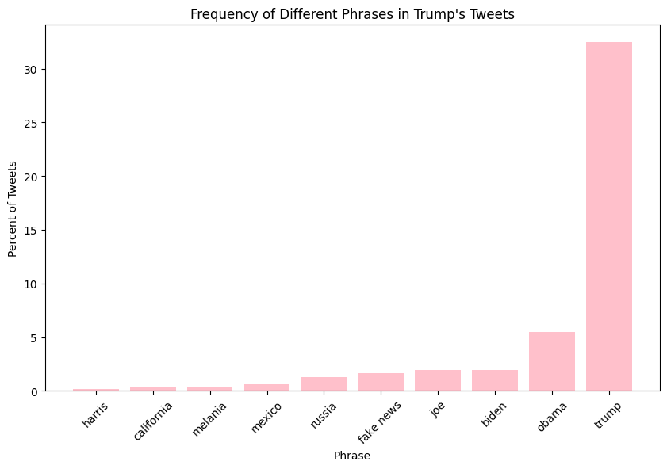

# Analysis of Trump's Tweets

## Markdown Table of Tweet Percentages
| Phrase           | Percent of Tweets |
| ---------------- | ----------------- |
|            biden | 01.97             |
|       california | 00.37             |
|        fake news | 01.66             |
|           harris | 00.19             |
|              joe | 01.93             |
|          melania | 00.40             |
|           mexico | 00.62             |
|            obama | 05.51             |
|           russia | 01.32             |
|            trump | 32.45             |

## Image

This document contains a table showing the rate at which Trump mentions specific phrases in his tweets, as well as a corresponding plot of the information.
