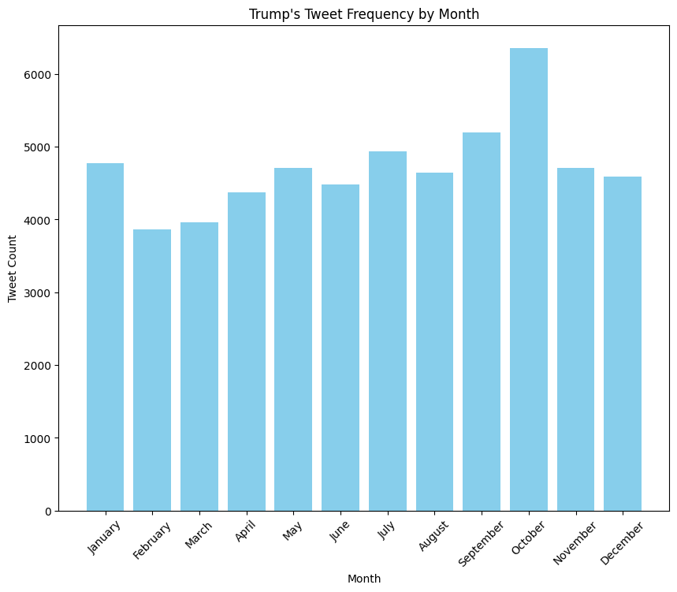

# LAB07: Analysis of Trump's Tweets

This document contains a table showing the rate at which Trump mentions specific phrases in his tweets, as well as a corresponding plot of the information. I used the latest version of the data from [The Trump Archive](https://www.thetrumparchive.com/faq), which is why my numbers are slightly different than Mike's. 

## Table of Tweet Percentages
| Phrase           | Percent of Tweets |
| ---------------- | ----------------- |
|            biden | 01.97             |
|       california | 00.37             |
|        fake news | 01.66             |
|           harris | 00.19             |
|              joe | 01.93             |
|          melania | 00.40             |
|           mexico | 00.62             |
|            obama | 05.51             |
|           russia | 01.32             |
|            trump | 32.45             |

## Image

I also created an additional plot showing the number of tweets Trump publishes during each month of the year. This is meant to display any annual patterns over the period, investigating whether he tweets more during election season, etc. 

## Extra Credit Image
